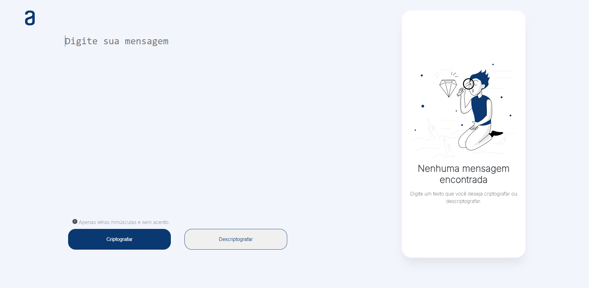
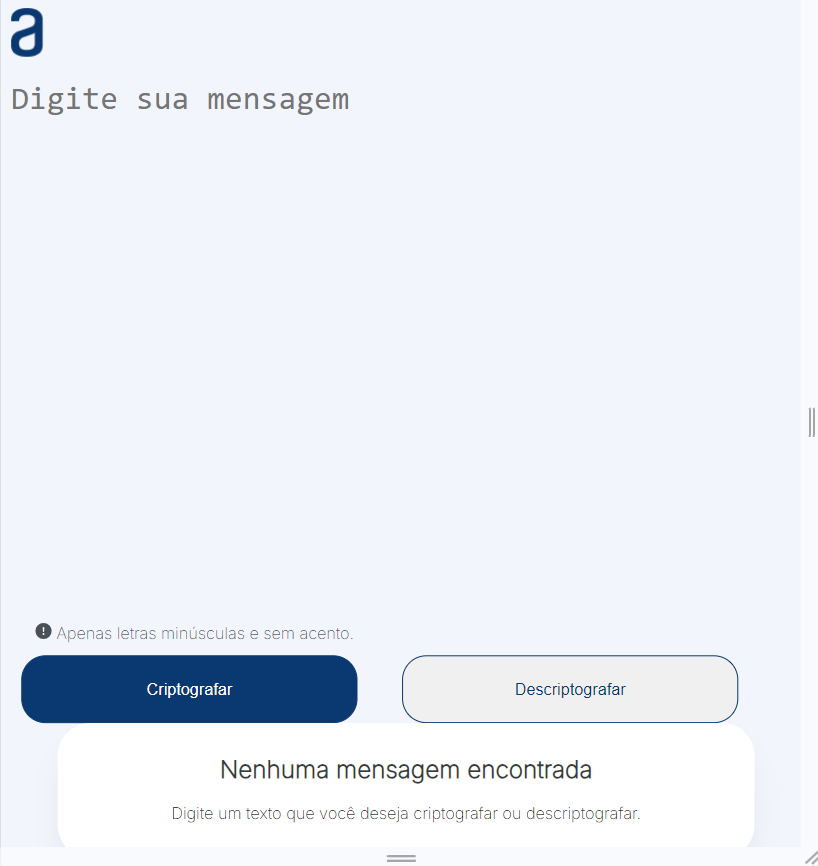
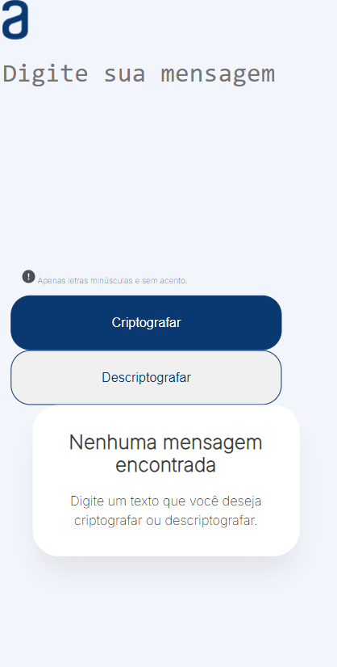

# Aplicação Web de Criptografia de Textos

Este projeto é uma aplicação web desenvolvida durante o **Alura Challenge Oracle ONE Iniciante em Programação**, que permite a criptografia e descriptografia de textos. A aplicação foi construída utilizando **HTML**, **CSS**, e **JavaScript**.

## Funcionalidades

- **Criptografar**: Transforma o texto inserido em uma versão criptografada.
- **Descriptografar**: Reverte o texto criptografado ao seu estado original.
- **Copiar Texto**: Permite copiar o resultado criptografado ou descriptografado para a área de transferência.
- **Responsividade**: A aplicação se adapta a diferentes tamanhos de tela.

## Responsividade

A aplicação foi projetada para ser responsiva em três diferentes tamanhos de tela:

- **Desktop e Notebooks**: 1280px
- **Tablets e iPads**: 800px
- **Mobile**: 420px

## Desafios

Um dos maiores desafios enfrentados durante o desenvolvimento foi a aplicação da responsividade. Com a ajuda de desenvolvedores mais experientes, documentação online, tutoriais no YouTube e o suporte do ChatGPT, consegui superar esses desafios. Através de tentativa e erro, integrei informações de várias fontes para implementar a responsividade de forma eficaz.

